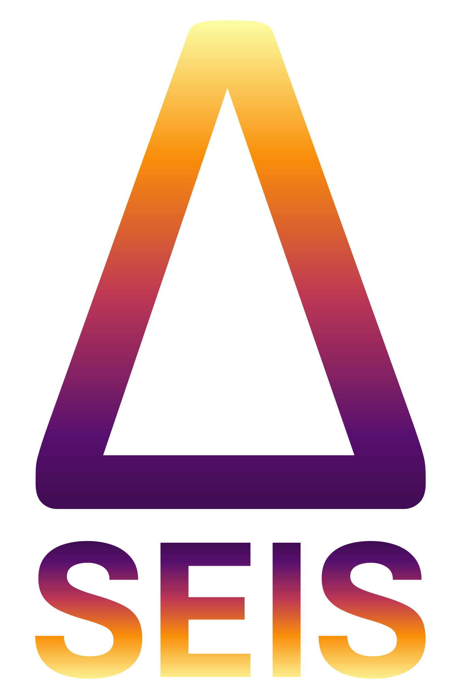

# deltaseis-projects



This repo keeps the [`deltaseis`](https://github.com/) library itself clean and
generic, while storing the **project-specific processing flows** that use it
here. Every survey/project gets its own folder under `projects/` with a script
(or scripts) that document exactly how the SEG-Y data for that project was
processed, so the result is reproducible later without digging through chat
history or notebooks.

## Structure

```
projects/
    <project_name>/
        <script>.py   # processing flow for that project
```

Each script typically:
1. Points to a folder of raw SEG-Y files (via an environment variable, see below).
2. Loads each file with `Segy_edit` and the trace data into a `Seismic` object.
3. Applies the processing steps used for that specific project (gain,
   averaging, deconvolution, etc.).
4. Writes the processed result back out to SEG-Y next to the input.

## Setup

1. Install [pixi](https://pixi.sh/) if you don't have it yet.
2. From the repo root, install the environment:
   ```
   pixi install
   ```
3. Copy the environment template and fill in your local data folders:
   ```
   copy .env_example .env
   ```
   Edit `.env` and replace the dummy paths with the real folders on your
   machine for each project (e.g. `ARK_SILAS_FOLDER=C:\Projects\...\sgy`).
   `.env` is gitignored, so your local paths are never committed.
4. Run a project script with pixi, e.g.:
   ```
   pixi run python projects/ark_silas/ark_silas.py
   ```

## Adding a new project

1. Create a new folder under `projects/<project_name>/`.
2. Add an environment variable for its input folder to `.env_example` (with a
   dummy value like `your/project/folder`) and to your own `.env`.
3. Write the processing script, loading the folder with `load_dotenv()` and
   `os.environ["<PROJECT>_FOLDER"]` instead of a hardcoded path.
